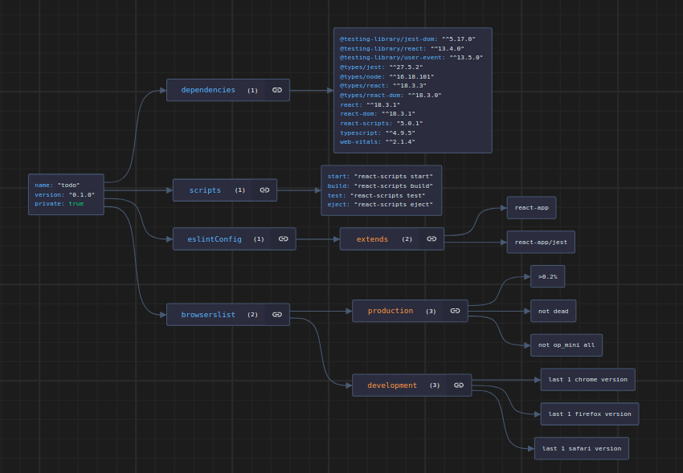
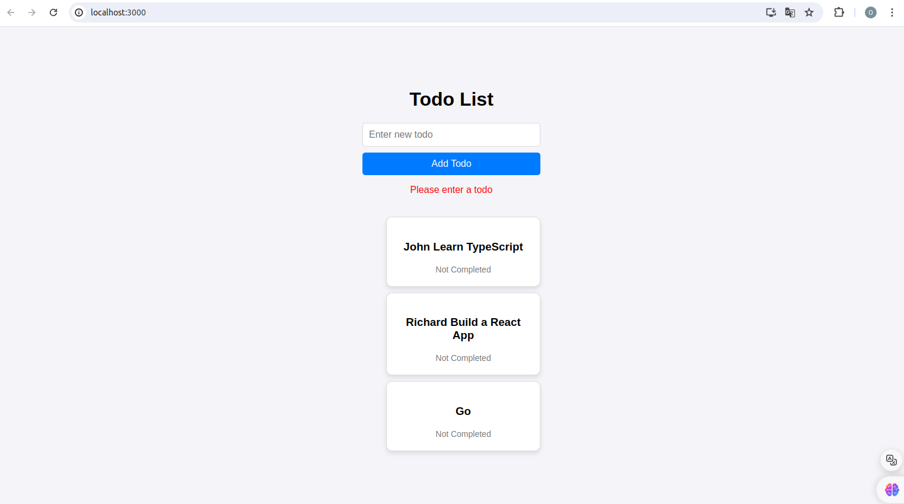
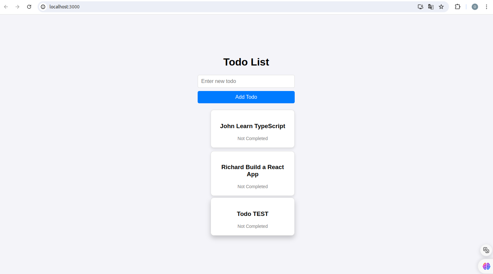

# App Todo

This project with react.

## Table of Contents

- [App Todo](#app-todo)
  - [Table of Contents](#table-of-contents)
    - [`Structure project`](#structure-project)
    - [`install node_modules`](#install-node_modules)
    - [`npm start`](#npm-start)
    - [`View structure json`](#view-structure-json)
    - [`npm run build`](#npm-run-build)
    - [`Add other todo`](#add-other-todo)
    - [`Validation Code`](#validation-code)
    - [`Part of Code`](#part-of-code)

In the project directory, you can run:

### `Structure project`

├── App.css
├── App.test.tsx
├── App.tsx
├── components
│ ├── TodoItem.tsx
│ └── TodoList.tsx
├── index.css
├── index.tsx

### `install node_modules`

`npm install`

### `npm start`

Runs the app in the development mode.\
Open [http://localhost:3000](http://localhost:3000) to view it in the browser.
The page will reload if you make edits.\
You will also see any lint errors in the console.

### `View structure json`



### `npm run build`



### `Add other todo`



### `Validation Code`

```html
<button type="submit">Add Todo</button>
{error && <p style={{ color: "red" }}>{error}</p>}
```

### `Part of Code`

```tsx
const handleAddTodo = (event: React.FormEvent) => {
  event.preventDefault();
  if (newTodo.trim() === "") {
    setError("Please enter a todo");
    return;
  }

  const todo: Todo = {
    id: todos.length + 1,
    title: newTodo,
    completed: false,
  };
  setTodos([...todos, todo]);
  setNewTodo("");
  setError("");
};
```

MIT License
Copyright (c) 2024
